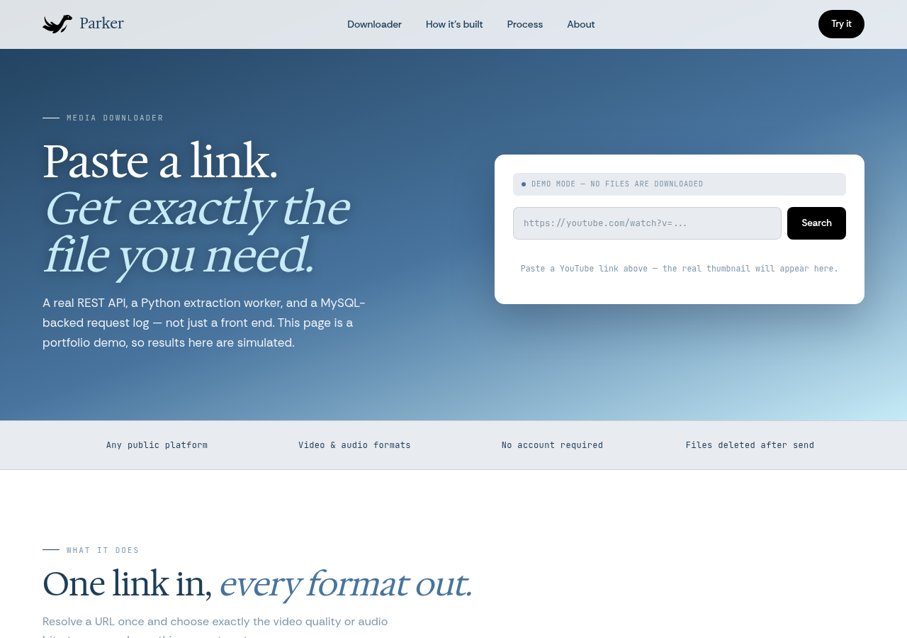
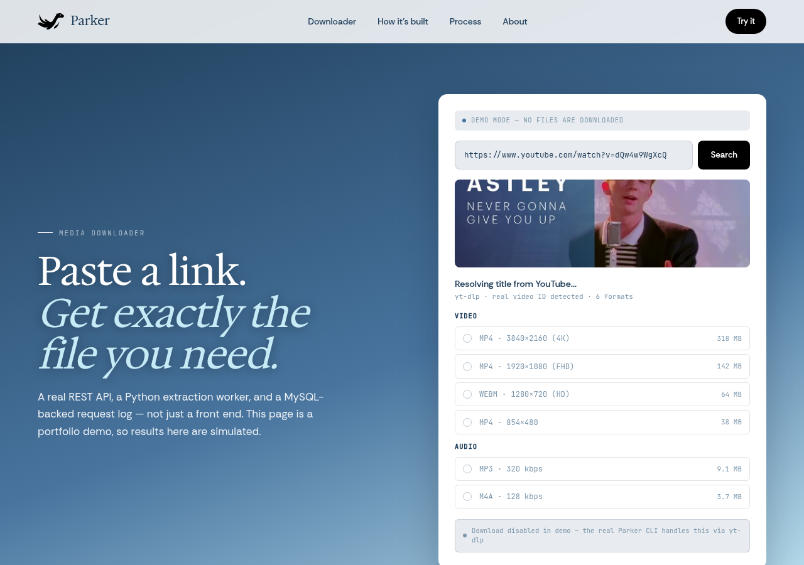
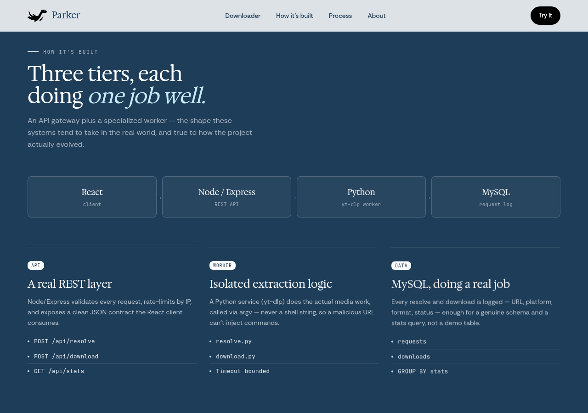
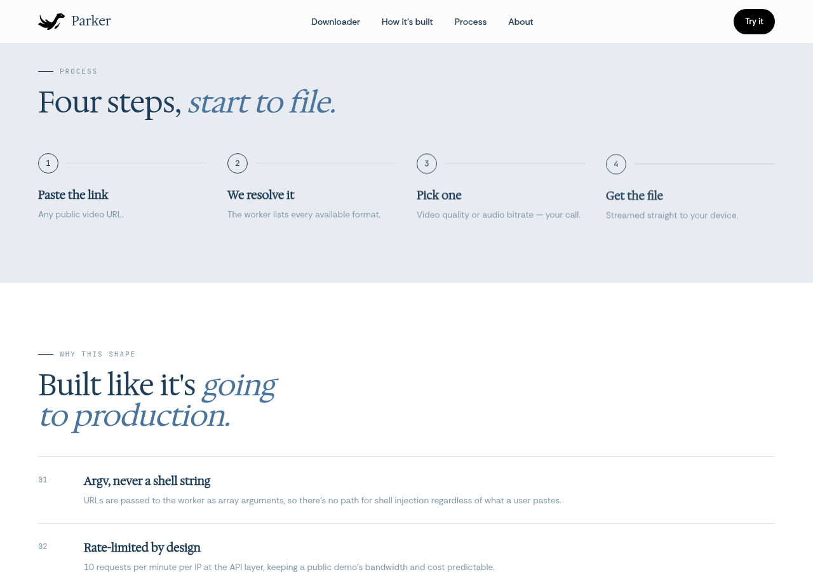
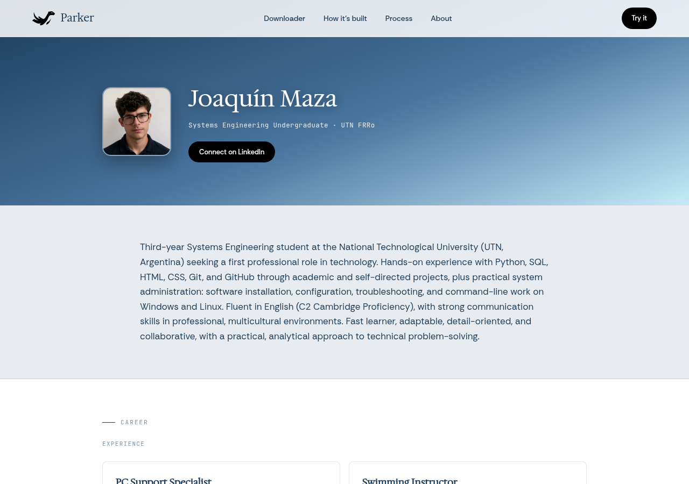

# Parker — Full-stack media downloader

> **Portfolio demo.** The web frontend is a non-functional mockup. No files are downloaded and no backend is running. It exists to show the architecture and design decisions behind the original CLI project built for Linux.



---

## What is Parker?

Parker is a three-tier media downloader originally built as a Linux CLI tool. The user pastes a public video URL (YouTube, Twitch, etc.), the system resolves every available format via yt-dlp, the user picks one, and the file is streamed straight to their machine.

The web version presented here is a **portfolio mockup** built in Next.js. It demonstrates the full UI, the architectural decisions, and the security patterns — without running a real backend, so it can be hosted at zero cost.

---

## Live demo

The downloader widget accepts any YouTube URL and fetches the **real video thumbnail** directly from `img.youtube.com` — no server required. Format cards (resolution, codec, file size) are simulated but reflect realistic values produced by the real yt-dlp worker.



---

## Architecture



The system is split into three tiers, each with a single responsibility:

```
Browser (React)
    │
    │  POST /api/resolve   { url }
    │  POST /api/download  { url, format_id }
    │  GET  /api/stats
    ▼
Node / Express  ──── rate-limit by IP ────▶  Python worker (yt-dlp)
    │                                              │
    │                                     resolve.py / download.py
    │                                     called via argv[], never shell string
    ▼
MySQL
  requests  (url, platform, ip_hash, status, created_at)
  downloads (request_id, format_id, codec, resolution, bytes, duration_ms)
```

### Tier 1 — React client

Single-page UI. Sends JSON to the Express API and renders the format list. No business logic lives here.

### Tier 2 — Node / Express REST API

- Validates every incoming request and rate-limits by IP (10 req / min).
- Spawns the Python worker via `child_process.execFile` with `argv[]` — never a shell string, so a malicious URL cannot inject commands.
- Exposes three endpoints: `POST /api/resolve`, `POST /api/download`, `GET /api/stats`.

### Tier 3 — Python worker + MySQL

- `resolve.py` calls `yt-dlp --dump-json` and returns the format list as JSON.
- `download.py` streams the selected format to stdout; Express pipes it to the HTTP response.
- Every request and download is logged to MySQL with a hashed IP, platform tag, format metadata, and duration — enough for a real `GROUP BY platform` stats query.

---

## Request flow (four steps)



| Step | What happens |
|------|-------------|
| 1. Paste the link | User submits any public video URL. |
| 2. Resolve | Express spawns the Python worker; yt-dlp returns every available format. |
| 3. Pick one | User selects video quality (4K / FHD / HD / SD) or audio bitrate (MP3 320 kbps / M4A 128 kbps). |
| 4. Get the file | The worker streams the file; Express pipes it to the browser response. MySQL logs the event. |

---

## Security decisions

| Decision | Why |
|----------|-----|
| **argv[], never a shell string** | URLs are passed as array arguments to `execFile`. There is no shell involved, so shell metacharacters in a URL are inert. |
| **Rate-limited by design** | 10 requests per minute per IP at the API layer keeps bandwidth and cost predictable for a public demo. |
| **IPs stored as SHA-256 hashes** | The raw IP is never persisted. The hash is enough for rate-limit lookups and abuse audits. |
| **Files deleted after send** | Temporary files are unlinked immediately after the HTTP response completes — nothing accumulates on disk. |
| **Input validation on every endpoint** | URL format, format ID, and request shape are validated before the worker is ever spawned. |

---

## Tech stack

| Layer | Technology |
|-------|-----------|
| Frontend | React 18, Vite |
| API gateway | Node.js, Express |
| Worker | Python 3, yt-dlp |
| Database | MySQL 8 |
| Web mockup | Next.js 16, Tailwind CSS v4 |
| Hosting (mockup) | Vercel (static, free tier) |

---

## Repository structure

```
Parker/
├── client/               # React frontend (Vite)
│   ├── App.jsx
│   ├── DownloadPage.jsx
│   └── AboutPage.jsx
├── server/               # Node / Express API
│   ├── index.js
│   ├── routes/
│   └── middleware/
├── worker/               # Python yt-dlp wrapper
│   ├── resolve.py
│   └── download.py
├── db/                   # MySQL schema & migrations
│   └── schema.sql
└── app/                  # Next.js mockup (this site)
    ├── page.tsx
    ├── about/page.tsx
    └── components/
```

---

## About the author



**Joaquín Maza** — Systems Engineering undergraduate at UTN FRRo (Argentina). Hands-on experience with Python, SQL, HTML/CSS, Git, and Linux system administration. C2 Cambridge English Proficiency.

[Connect on LinkedIn](https://www.linkedin.com/in/joaquin-maza/) · [Original CLI repo](https://github.com/Vuadens/YT-dlp-downloader-for-Linux)

---

*Parker — portfolio demo. Results on this site are simulated. · Joaquín Maza · 2025*
